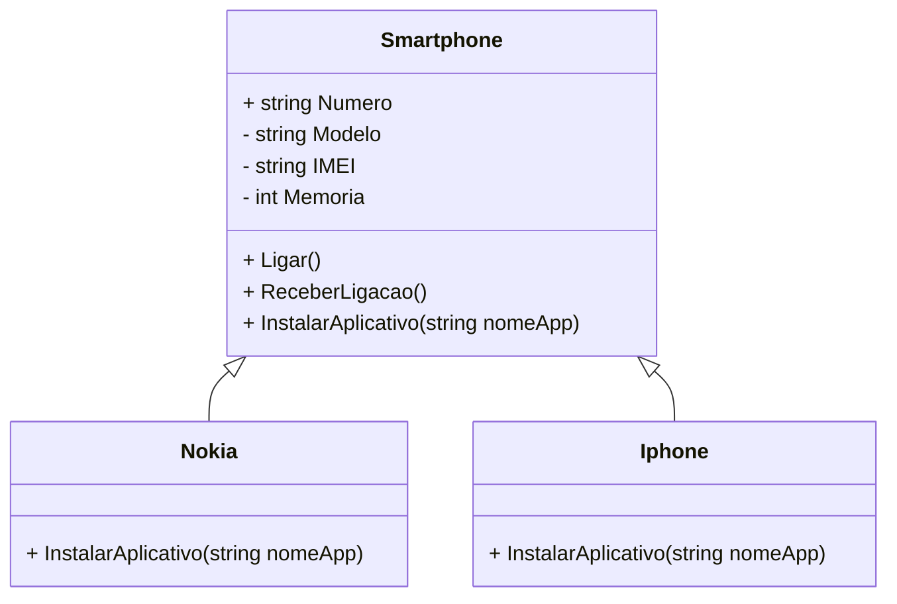

# Desafio: Sistema de Celulares em .NET

Este projeto faz parte de um desafio proposto pelo **Bootcamp XP Inc. - Full Stack Developer** da **DIO**. O objetivo do desafio é modelar um sistema de celulares utilizando os princípios de **Programação Orientada a Objetos (POO)** em C#. O foco é criar uma estrutura que permita o reuso de código e a personalização de comportamentos para diferentes marcas de smartphones.

## Descrição do Desafio

Foi solicitado o desenvolvimento de um sistema que abstrai a funcionalidade de celulares, onde as classes `Nokia` e `Iphone` herdam de uma classe base chamada `Smartphone`. A classe base contém comportamentos comuns, enquanto as classes específicas de cada marca implementam suas próprias versões de instalação de aplicativos, utilizando o conceito de **herança** e **polimorfismo**.

### Funcionalidades Implementadas

- A classe `Smartphone` define propriedades e métodos comuns a todos os celulares, como `Ligar`, `ReceberLigacao` e `InstalarAplicativo`.
- As classes `Nokia` e `Iphone` herdam de `Smartphone` e sobrescrevem o método `InstalarAplicativo`, permitindo comportamentos específicos para cada marca.

### Diagrama de Classes

Abaixo está o diagrama de classes que modela a solução implementada:

### Tecnologias Utilizadas
- NET C#: Para a implementação do sistema.
- Programação Orientada a Objetos (POO): Para abstração e reutilização de código.

### Estrutura de código
O código segue a seguinte estrutura:

- Smartphone.cs: Classe base abstrata que contém métodos e propriedades comuns aos celulares.
- Nokia.cs: Classe que herda de Smartphone e implementa o comportamento específico para celulares Nokia.
- Iphone.cs: Classe que herda de Smartphone e implementa o comportamento específico para iPhones.
- Program.cs: Classe principal que testa o funcionamento do sistema.

### Desafio Proposto
Este desafio foi proposto no Bootcamp XP Inc. - Full Stack Developer da DIO, com o intuito de aplicar e consolidar os conhecimentos sobre Programação Orientada a Objetos em C#.

